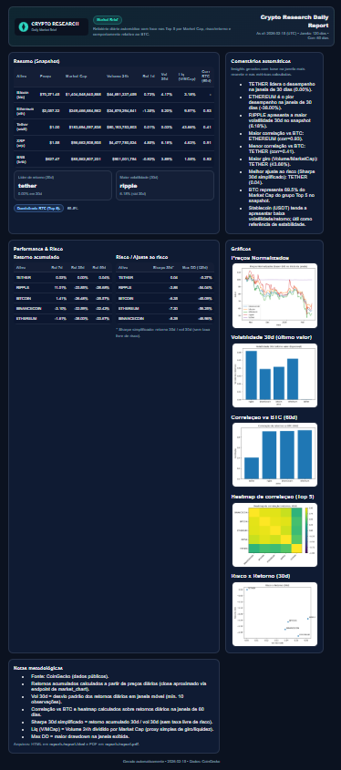
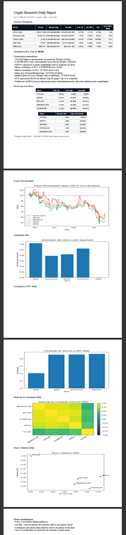

# Crypto Research ETL -- Quantitative Market Brief (Top 5 Crypto)


End-to-end crypto market research pipeline that extracts, transforms and analyzes cryptocurrency market data (Top 5 by Market Cap), generating an institutional-grade HTML/PDF report with performance, volatility, correlation and risk-adjusted metrics.


---

## 📑 Table of Contents

- [Overview](#overview)
- [Architecture](#architecture)
- [Tech Stack](#tech-stack)
- [Features \& Analytics](#features--analytics)
  - [📊 Snapshot Metrics](#-snapshot-metrics)
  - [📈 Performance Analytics](#-performance-analytics)
  - [⚠ Risk Metrics](#-risk-metrics)
  - [🔗 Correlation Structure](#-correlation-structure)
  - [📉 Risk vs Return](#-risk-vs-return)
  - [🏦 Market Structure](#-market-structure)
- [Project Structure](#project-structure)
- [Installation](#installation)
- [Usage](#usage)
  - [Optional Parameters](#optional-parameters)
- [Example Output](#example-output)
- [Methodology Notes](#methodology-notes)
- [Rate Limit Handling](#rate-limit-handling)
- [Future Improvements](#future-improvements)
- [License](#license)

---

## Overview

This project simulates a quantitative crypto research workflow:

`Extract → Transform → Load → Analyze → Report`

It builds a daily automated institutional-style report including:

-   Performance analysis
-   Risk metrics
-   Correlation structure
-   Liquidity indicators
-   Market dominance analysis

The output is delivered as:

-   📄 HTML report
-   📘 PDF report
-   📊 Professional charts

**HTML Version:**



**PDF Version:**



---

## Architecture

```text
CoinGecko API
      ↓
Extract Layer
      ↓
Transform Layer (Pandas)
      ↓
SQLite Database
      ↓
Analytics Engine
      ↓
Jinja2 + Matplotlib
      ↓
HTML + PDF Research Report
```

---

## Tech Stack

-   `Python 3.9+`
-   `Pandas` -- data transformation
-   `SQLAlchemy` -- database layer
-   `SQLite` -- local storage
-   `Matplotlib` -- visualizations
-   `Jinja2` -- HTML templating
-   `ReportLab` -- PDF generation
-   `CoinGecko API` -- market data source

---

## Features & Analytics

### 📊 Snapshot Metrics

-   Price (USD)
-   Market Cap
-   24h Volume
-   Daily Return
-   Rolling 30d Volatility
-   Liquidity Ratio (Volume / Market Cap)
-   Correlation vs BTC

---

### 📈 Performance Analytics

-   7d cumulative return
-   30d cumulative return
-   90d cumulative return
-   Leader / laggard detection

---

### ⚠ Risk Metrics

-   Rolling 30d Volatility
-   Simplified Sharpe Ratio (30d)
-   Maximum Drawdown (window)
-   Risk-adjusted ranking

---

### 🔗 Correlation Structure

-   Correlation vs BTC
-   Correlation heatmap (Top 5)
-   Rolling correlation window configurable

---

### 📉 Risk vs Return

-   Scatter plot (30d return vs 30d volatility)
-   Asset labeling for visual comparison

---

### 🏦 Market Structure

-   BTC dominance (Top 5 subset)
-   Liquidity proxy (Volume / Market Cap)

---

## Project Structure

    crypto-research-etl/
    │
    ├── data/                 # SQLite database
    ├── reports/
    │   ├── charts/
    │   ├── assets/
    │
    ├── src/
    │   └── crypto_etl/
    │
    ├── templates/
	│   └── report.html
    ├── requirements.txt
    ├── README.md
    └── LICENSE

---

## Installation

``` bash
python -m venv .venv
# Windows:
.venv\Scripts\activate

pip install -r requirements.txt
```

---

## Usage

From project root:

``` bash
set PYTHONPATH=src
python -m crypto_etl.cli all --days 120 --pause 3
```

Outputs:

-   data/crypto.db
-   reports/report.html
-   reports/report.pdf
-   reports/charts/\*.png

---

### Optional Parameters

Adjust analysis windows:

``` bash
python -m crypto_etl.cli report \
  --window-days 180 \
  --perf-window 60 \
  --corr-window 90
```

Disable PDF:

``` bash
python -m crypto_etl.cli report --no-pdf
```

---

## Example Output

The report includes:

-   Institutional-style layout
-   Automated commentary
-   Multi-section analytics
-   Clean chart visualizations
-   Professional PDF export


---

## Methodology Notes

-   Returns calculated from daily close prices.
-   Volatility = rolling standard deviation of daily returns.
-   Sharpe (simplified) = 30d cumulative return / 30d volatility.
-   Correlation computed on daily returns.
-   Liquidity ratio = Volume 24h / Market Cap.
-   Top 5 is dynamically recalculated at extraction time.

---

## Rate Limit Handling

If you encounter:

`HTTPError: 429 Too Many Requests`

Increase pause:

``` bash
python -m crypto_etl.cli all --days 120 --pause 5
```

Exponential backoff retry logic is implemented.

---

## Why This Project?

This project was designed to simulate a real-world quantitative research workflow, combining data engineering, analytics and automated reporting into a functional system.

It demonstrates:
- End-to-end ETL design
- Analytical modeling
- Risk metrics implementation
- Report automation
- Clean project structuring

---

## Future Improvements

-   Rolling correlation charts
-   Portfolio simulation (equal-weight basket)
-   Risk contribution analysis
-   API deployment (FastAPI)
-   Docker containerization
-   Scheduled automation (airflow / cron)

------------------------------------------------------------------------

## License

MIT License
